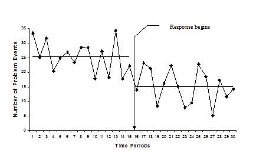

```{r setup, include=FALSE}
library(tidyverse); library(changepoint)
knitr::opts_chunk$set(echo = FALSE)
```

## This session

<font color = "#000099">

- Context

- What is changepoint analysis

- Why use it

- When to use it

- Case Study: Sexual offences on public transport

</font>

## The context

Understanding the impact of policing interventions is essential to building an evidence base.

<div>

<center>


</center>

</div>


## Crime trends

Time series are often used in enforcement to:


<font color = "DarkBlue">

- Monitor crime trends

- Understand seasonal patterns

- Check whether an intervention has worked

<br>

Data can be noisy, and the volume of offences often fluctuate, it can be hard to tell whether a genuine change occured and at what point.

</font>


## Detecting changes

Ideally we want something that does this

<centre></centre>

<font size = 3>

**Source**: www.popcentre.org

</font>


## Changepoint package

Authored by:

<font color = "DarkBlue" size = 4>

- Rebecca Killick (Lancaster University)
- Kaylea Haynes
- Idris Eckley
- Paul Fearnhead
- Jamie Lee

</font>

<font size  = 3>

**The main paper**: Killick, Rebecca and Eckley, Idris (2014) changepoint : an R package for changepoint analysis. Journal of Statistical Software, 58 (3). pp. 1-19.

</font>

<font size = 4>

The package provides a range of methods for detecting changes in time series data. We can install and load into R as follows:

install.packages("changepoint") 

library(changepoint)

</font>

## Testing an intervention example

<font size = 4>

**Scenario**

A new police operation was launched to combat the high level of violent offences in Townsville. We want to know if violence reduced following the start of the intervention. 

</font>

```{r, echo =FALSE, warning= FALSE, message=FALSE, fig.height=4, fid.width = 6}
#simulate some data data fro AMOC

#Create the number of weeks
set.seed(6)

week<- c(1:24)

#simulate offences for the first week using a poisson distribution
violent_off1<- rpois(n = 12, lambda = 6)

#then second week
violent_off2<- rpois(n = 12, lambda = 3)

#we can combine these together really easily using the 'c'
violent_off<- c(violent_off1, violent_off2)

#and create a data.frame object
crime_df<- data.frame(week = week, violent_off = violent_off)

#let's see what the data looks like
ggplot(data = crime_df)+
      geom_line(aes(x = week, y = violent_off, group = 1), colour = "red")+
      labs(y = "count of offences", title = "Violent offences by week")+
      geom_vline(xintercept = 12, colour = "blue")+
      annotate(geom = "text", x =  14.5, y = 10, label = "Police Intervention")+
      theme_bw()

```

## Using Changepoints - AMOC

<font size = 4>

Changepoint has a very straight forward function for analysing whether a change in the mean or average number of crime has occured: cpt.mean().

We simply feed our data into the function and by default it will look to see whether At Most Once Change (AMOC) happened.

That's useful if we want to test whether our intervention has had an impact and we can plot the result too.

</font>

```{r, echo =FALSE, warning= FALSE, message=FALSE, fig.height=3.5, fid.width = 4}
mean_changepoint<- changepoint::cpt.mean(crime_df$violent_off)

plot(mean_changepoint, ylab = "Number of offences", 
     main = "Changepoint in violent offences following police intervention")

```